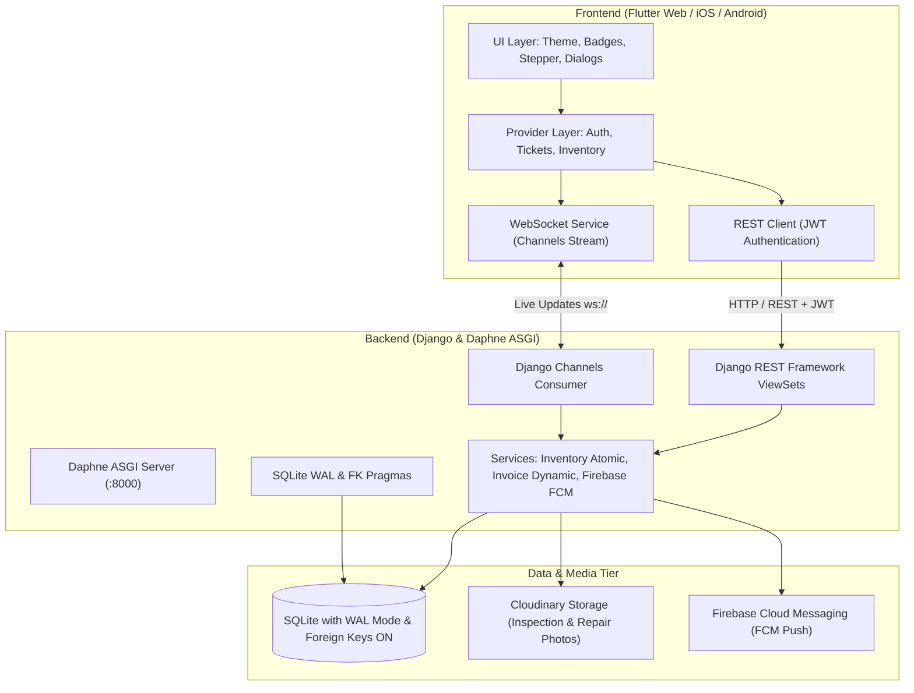
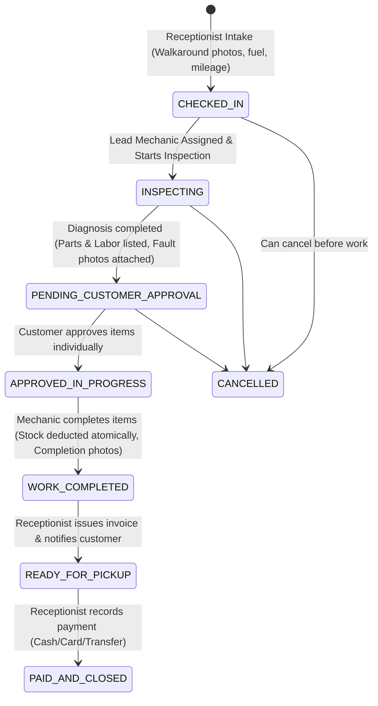

# Car Garage Management System 🚗🔧

A production-grade, full-stack Car Garage Management System engineered with **Python/Django + DRF + Django Channels (WebSockets)** and a **Flutter (Web & Mobile)** frontend.

---

## 🏗️ System Architecture



---

## 🎨 UI / UX Design System (Implemented in Flutter)

### 1. Color Palette
- **Primary**: `#1E3A5F` (Deep Steel Blue) — Headers, AppBars, navigation bars, primary action buttons
- **Accent**: `#F97316` (Safety Orange) — Main CTAs, item approvals, active progress indicators
- **Background**: `#F8FAFC` (Near-white Gray) — Scaffold background
- **Surface / Cards**: `#FFFFFF` (Pure White) — Cards, modal sheets, tables, and list tiles
- **Primary Text**: `#1E293B` (Slate Dark)
- **Secondary / Muted Text**: `#64748B` (Slate Muted)
- **Border / Divider**: `#E2E8F0`

### 2. Status Badge Mapping (`ticket_status`)
- `CHECKED_IN`: `#94A3B8` (Slate Gray)
- `INSPECTION_PENDING` / `INSPECTING`: `#3B82F6` (Vibrant Blue)
- `PENDING_CUSTOMER_APPROVAL`: `#F59E0B` (Amber)
- `APPROVED_IN_PROGRESS`: `#6366F1` (Indigo)
- `WORK_COMPLETED`: `#14B8A6` (Teal)
- `READY_FOR_PICKUP`: `#F97316` (Safety Orange)
- `PAID_AND_CLOSED`: `#22C55E` (Emerald Green)
- `CANCELLED`: `#EF4444` (Rose Red)

### 3. Inventory Out-of-Stock Indicator
- Background tint: `#FEE2E2`
- Text / Border: `#EF4444`

### 4. Pill-Shaped Status Badges
- Implemented in [`StatusBadge`](file:///d:/Write%20Code/flutter/Car_Gar/frontend/lib/widgets/status_badge.dart) with `BorderRadius.circular(20)`, compact padding (`horizontal: 10, vertical: 4`), background at 14% opacity and 100% full-strength color for label and border.

---

## 🔄 Business Flow & State Machine



---

## 👥 Core Roles & Pre-configured Demo Users

Use the **Role Simulator** bar at the top of the Flutter app to switch roles instantly with a single tap:

| Role | Username | Full Name | Capabilities |
| :--- | :--- | :--- | :--- |
| **Customer** | `customer_user` | John Doe | Track vehicle progress live, item-by-item approval screen with `#F97316` Approve & `#EF4444` Reject, review photos grouped by stage, view invoice |
| **Mechanic** | `mechanic_user` | Mike Miller | Inspection diagnosis, add parts/labor, upload fault/repair photos, tick completed tasks, trigger atomic inventory deduction |
| **Receptionist** | `reception_user` | Sarah Connor | Customer check-in intake modal, walkaround photos, issue invoices, collect payment (Cash, Card, Transfer, Online) |
| **Admin** | `admin_user` | Alex Stone | Revenue metrics, ticket breakdown, inventory warehouse management, low-stock alerts (`#FEE2E2` / `#EF4444`), restock parts |

---

## 🗄️ Database & SQLite Optimizations

Configured in [`backend/settings.py`](file:///d:/Write%20Code/flutter/Car_Gar/backend/backend/settings.py):
- **UUID Primary Keys**: All models utilize `UUIDField(primary_key=True, default=uuid.uuid4, editable=False)`.
- **TextChoices**: Strict SQL `CHECK` constraints on SQLite for all roles and statuses.
- **WAL Mode & Foreign Keys**: Enforced on connection via database signal:
  ```python
  @receiver(connection_created)
  def enable_sqlite_pragmas(sender, connection, **kwargs):
      if connection.vendor == 'sqlite':
          cursor = connection.cursor()
          cursor.execute('PRAGMA foreign_keys = ON;')
          cursor.execute('PRAGMA journal_mode = WAL;')
          cursor.execute('PRAGMA synchronous = NORMAL;')
          cursor.close()
  ```

---

## ⚡ Realtime WebSockets (Django Channels)

- WebSocket URL: `ws://127.0.0.1:8000/ws/tickets/<ticket_id>/` and `ws://127.0.0.1:8000/ws/tickets/`
- Real-time events broadcasted:
  - `TICKET_CREATED`
  - `STATUS_CHANGED`
  - `MECHANIC_ASSIGNED`
  - `ITEM_ADDED`
  - `ITEMS_APPROVED`
  - `ITEM_COMPLETED` (with atomic stock deduction)
  - `PHOTO_UPLOADED`
  - `PAYMENT_RECORDED`

---

## 🚀 How to Run

### 1. Start the Backend Server (Django ASGI / Channels)
```powershell
cd backend
python manage.py migrate
python manage.py seed_garage_data
python manage.py runserver 127.0.0.1:8000
```

### 2. Run the Flutter Application
```powershell
cd frontend
# For Web (Chrome)
flutter run -d chrome

# For Windows Desktop
flutter run -d windows
```
